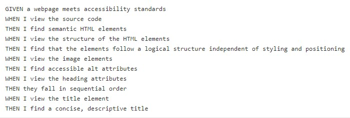
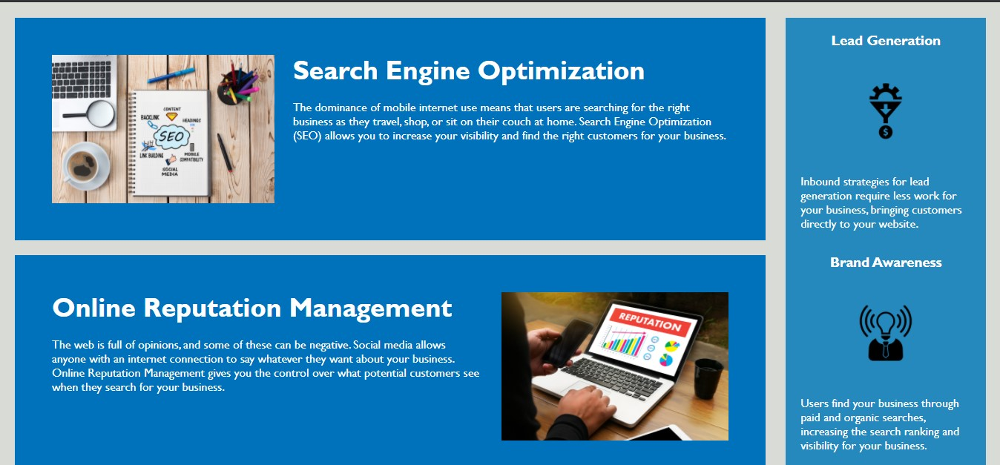

## Code Refactor Homework

# Overview
In this project, I was tasked with improving the website's accessibility and semantic elements. This was achieved by adding alt tags to all picutres and using semantic tags to improve the overall code.

# Requirements

# Pictures of Website

# Link to Website
[Click here to view website](https://kaileesmith.github.io/Code-Refactor/)